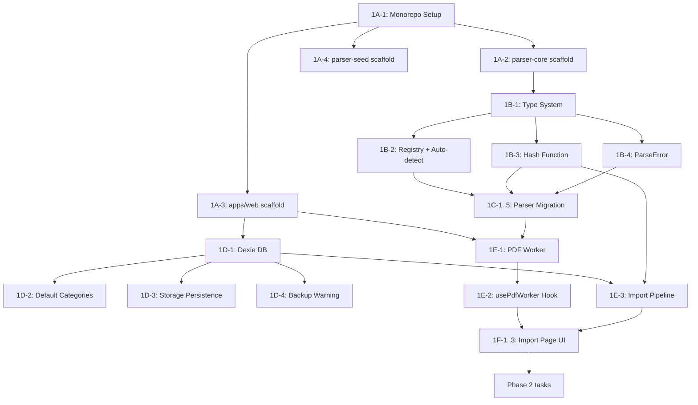

# Lokfi — Implementation Plan & Task Breakdown

> Derived from [architecture.md](file:///c:/Users/Admin/Desktop/Projects/jmyn/lokfi/docs/architecture.md) (v1.1), [design.md](file:///c:/Users/Admin/Desktop/Projects/jmyn/lokfi/docs/design.md) (v1.0), and [lokfi-action-plan.md](file:///c:/Users/Admin/Desktop/Projects/jmyn/lokfi/docs/lokfi-action-plan.md)

This document breaks the Lokfi rearchitecture into **small, self-contained, executable tasks** grouped by phase and component. Each task has clear inputs, outputs, and acceptance criteria so the next agent can pick it up and execute without ambiguity.

> [!IMPORTANT]
> **No code exists yet.** The `lokfi/` directory currently contains only `docs/`. Everything below is greenfield.

---

## Phase 1 — Foundation (Weeks 1–2)

### 1A. Monorepo Scaffolding

#### Task 1A-1: Initialize pnpm workspace + Turborepo

- Create `lokfi/package.json` (workspace root) with `"private": true`
- Create `lokfi/pnpm-workspace.yaml` pointing to `packages/*` and `apps/*`
- Create `lokfi/turbo.json` with `build`, `dev`, `lint`, `test` pipelines
- Add shared configs: `tsconfig.base.json`, `.prettierrc`, `.eslintrc`
- **Acceptance:** `pnpm install` succeeds at root, `pnpm turbo build` runs (no-op)

#### Task 1A-2: Scaffold `packages/parser-core`

- Create `packages/parser-core/package.json` with name `@lokfi/parser-core`, `"type": "module"`
- Create `packages/parser-core/tsconfig.json` extending base
- Create `packages/parser-core/src/index.ts` (empty public API barrel export)
- Create `packages/parser-core/src/types.ts` with all shared types: `StatementSource`, `StatementType`, `Transaction`, `ConsolidatedTransaction`, `StatementParser`, `Statement`, `DebitStatement`, `CreditStatement`
- Set up Vitest for the package (`vitest.config.ts`)
- **Acceptance:** `pnpm --filter @lokfi/parser-core build` produces dist; `pnpm --filter @lokfi/parser-core test` runs (empty suite passes)

#### Task 1A-3: Scaffold `apps/web` with Vite + React 19

- Run `npx -y create-vite@latest ./apps/web --template react-ts` (or similar)
- Install core deps: `react@19`, `react-dom@19`, `@tanstack/react-router`, `dexie`, `recharts`, `react-hook-form`, `zod`, `next-themes`, `pdfjs-dist`
- Install UI deps: `tailwindcss`, `@shadcn/ui`, `lucide-react`, `sonner`
- Configure Tailwind, PostCSS, shadcn
- Create basic `App.tsx` with router shell and placeholder pages
- **Acceptance:** `pnpm --filter @lokfi/web dev` serves at localhost, blank shell renders

#### Task 1A-4: Scaffold `packages/parser-seed` (dev CLI)

- Create `packages/parser-seed/package.json` with name `@lokfi/parser-seed`
- Create `packages/parser-seed/src/index.ts` with CLI entrypoint (yargs or commander)
- Stub transformations: account number replacement, name redaction, date shifting, amount fuzzing
- **Acceptance:** `pnpm --filter @lokfi/parser-seed run seed --help` prints usage

---

### 1B. Type System & Parser Infrastructure

#### Task 1B-1: Define the complete type system in `parser-core/src/types.ts`

Implement all types from architecture doc §4:

```typescript
export type StatementSource = 'ocbc' | 'dbs' | 'uob' | 'citibank' | 'cdc' | 'maybank'
export type StatementType = 'credit' | 'debit'

export interface Transaction {
  date: string               // ISO 8601
  description: string
  transactionValue: number   // negative = outflow, positive = inflow
  balance?: number
}

export interface ConsolidatedTransaction extends Transaction {
  source: StatementSource
  accountNo: string
  hash: string
}

export interface StatementParser {
  parse(text: string): Statement
  detect(text: string): boolean
}

// ... Statement, DebitStatement, CreditStatement
```

- **Acceptance:** Types compile, exported from `index.ts`

#### Task 1B-2: Implement parser registry + auto-detect

- Create `parser-core/src/registry.ts`
- Implement `ParserRegistry: Record<StatementSource, Partial<Record<StatementType, StatementParser>>>`
- Implement `detectParser(pdfText: string): StatementParser | null` — iterate all registered parsers, call `detect()`, return first match
- **Acceptance:** Unit test — registry returns `null` for unrecognised text, returns correct parser for known text snippets

#### Task 1B-3: Implement `generateTransactionHash()`

- Create `parser-core/src/hash.ts`
- Hash input: `source + accountNo + date + transactionValue + description + (balance | _occurrenceIndex)`
- Use Web Crypto API's `crypto.subtle.digest('SHA-256', ...)` (universal, no extra dep)
- Balance takes priority; `occurrenceIndex` used when balance is `undefined`
- **Acceptance:** Unit tests for: unique hashes for different txns, same hash for identical re-imports, different hashes for same-day identical txns with different balance/occurrenceIndex

#### Task 1B-4: Implement custom `ParseError` class

- Create `parser-core/src/errors.ts`
- `ParseError` with `bank`, `statementType`, `message`, `rawSnippet?` fields
- **Acceptance:** Error can be thrown and caught with structured data

---

### 1C. Parser Migration (Deno → parser-core)

> [!NOTE]
> These tasks assume the existing Deno parser source is available to reference. Each parser is an independent, parallelisable task.

#### Task 1C-1: Migrate OCBC Credit parser

- Create `parser-core/src/parsers/ocbc/ocbc-credit.parser.ts`
- Implement `detect()` — check for OCBC credit statement heuristics
- Implement `parse()` — extract transactions from text
- Register in `registry.ts`
- Write unit tests with fixture data in `parsers/ocbc/__fixtures__/`
- **Acceptance:** Parses fixture file, produces correct `ConsolidatedTransaction[]`

#### Task 1C-2: Migrate OCBC Debit parser

- Same structure as 1C-1 for `ocbc-debit.parser.ts`
- Note: debit parser should extract `balance` field (OCBC debit shows running balance)

#### Task 1C-3: Migrate Citibank Credit parser

- `parsers/citibank/citibank-credit.parser.ts`

#### Task 1C-4: Migrate UOB Credit parser

- `parsers/uob/uob-credit.parser.ts`

#### Task 1C-5: Migrate CDC Debit parser

- `parsers/cdc/cdc-debit.parser.ts`
- Note: CDC debit shows running balance

---

### 1D. Database Layer (Dexie.js)

#### Task 1D-1: Implement Dexie database class

- Create `apps/web/src/lib/db/index.ts`
- Implement `LokfiDatabase` class from architecture doc §6 (schema v2)
- Tables: `transactions`, `rules`, `categories`, `settings`
- Indexes as specified
- Export singleton `db` instance
- **Acceptance:** DB opens in browser, tables are queryable

#### Task 1D-2: Implement default categories seed

- Create `apps/web/src/lib/db/seed.ts`
- Seed default categories on first launch: Food, Transport, Shopping, Bills, Entertainment, Health, Income, Transfer, Subscriptions, Others
- Each category gets: id (UUID), name, color (hex), icon (lucide name), isIncome flag
- Check `settings.get('seeded')` to avoid re-seeding
- **Acceptance:** First app load creates categories; second load does not duplicate

#### Task 1D-3: Implement StorageManager persistence request

- Create `apps/web/src/lib/db/persistence.ts`
- On app init: call `navigator.storage.persist()`, store result in settings
- If denied: show dismissible banner
- **Acceptance:** Banner appears when persistence denied; dismissed state persists

#### Task 1D-4: Implement backup warning system

- Check `lastExportedAt` in settings on app init
- If absent or > 30 days old, show persistent yellow banner: "You haven't exported a backup in over 30 days. [Export now →]"
- Banner auto-dismisses after successful export
- **Acceptance:** Banner shows for fresh install; disappears after export

---

### 1E. PDF Parsing Pipeline (Web Worker)

#### Task 1E-1: Create PDF Web Worker

- Create `apps/web/src/lib/workers/pdf-worker.ts`
- Configure `pdfjs-dist` worker source via `import.meta.url`
- Accept `ArrayBuffer` via `postMessage`
- Extract text from all pages, join them
- Call `detectParser()` from `@lokfi/parser-core`
- If matched: parse, return `ConsolidatedTransaction[]`
- If unmatched: return error `{ type: 'unsupported' }`
- If parse error: return error `{ type: 'parse_error', bank, message }`
- **Acceptance:** Worker processes a test PDF and returns structured transactions

#### Task 1E-2: Create `usePdfWorker` hook

- Create `apps/web/src/lib/workers/usePdfWorker.ts`
- Instantiate worker: `new Worker(new URL('./pdf-worker.ts', import.meta.url), { type: 'module' })`
- Expose: `processFile(file: File) → Promise<ParseResult>`
- Handle: progress events, success, error
- **Acceptance:** Hook callable from React component, returns parsed data

#### Task 1E-3: Implement deduplication + import pipeline

- Create `apps/web/src/lib/db/import.ts`
- Accept `ConsolidatedTransaction[]` from worker
- For each transaction:
  - Check if `hash` exists in DB
  - If hash AND all fields match → silent skip (exact re-import)
  - If hash matches but fields differ → flag as "Potential duplicate"
  - If no match → mark as new
- Return `ImportResult { imported: number, skipped: number, duplicates: DuplicateWarning[] }`
- `bulkAdd` new transactions to Dexie
- **Acceptance:** Unit test — re-importing same data produces 0 new; importing new data adds correctly

---

### 1F. Import Page UI

#### Task 1F-1: Build drag-and-drop upload zone

- Create `apps/web/src/routes/import.tsx`
- Large drag-and-drop zone with dashed border, drop icon, helper text
- "Or click to browse files" fallback
- Accept multiple PDF files
- Use `FileReader` API → ArrayBuffer → dispatch to worker
- **Acceptance:** Files can be dropped or selected; passed to worker

#### Task 1F-2: Build per-file status display

- Per-file status list below drop zone
- Show: filename → detected bank/type → ✅ parsed / ❌ error
- Processing indicator per file (not a full-page spinner)
- Duplicate warning rows with "Import anyway" action
- **Acceptance:** Visual feedback during parsing, errors shown inline

#### Task 1F-3: Build import summary banner

- Summary after all files processed: "X transactions imported, Y duplicates skipped"
- "View transactions →" CTA button
- **Acceptance:** Summary displays correct counts, CTA navigates to `/transactions`

---

## Phase 2 — Core Feature Polish (Weeks 3–5)

### 2A. Landing Page

#### Task 2A-1: Build landing/onboarding page at `/`

- Hero section: tagline, privacy badge, "Import your first statement" CTA
- How it works: 3-step visual (Drop PDF → See transactions → Understand spending)
- Supported banks: logo grid (OCBC, DBS, UOB, Citibank, CDC, Maybank + "More coming")
- Privacy section: open source badge, MIT, GitHub link
- Footer: GitHub, version
- **Acceptance:** Clean, minimal, responsive, dark/light theme

---

### 2B. Transaction Table

#### Task 2B-1: Build transaction table at `/transactions`

- Create `apps/web/src/routes/transactions.tsx`
- TanStack Table v8 with columns: Date (sortable), Description, Source, Account No, Amount (red/green), Category (inline dropdown)
- Virtual scrolling for large datasets
- **Acceptance:** Table renders 1000+ rows without jank

#### Task 2B-2: Implement table filters

- Search: full-text across description + source + accountNo
- Date range picker with presets: This month, Last month, Last 3 months, YTD, Custom
- Category filter (multi-select)
- "Uncategorised only" quick toggle
- Column visibility toggle
- **Acceptance:** Each filter works independently and in combination

#### Task 2B-3: Implement bulk categorisation

- Row selection (checkboxes)
- "Categorise selected" action → pick category → sets `manualCategory` on each row
- Optional follow-up: "Create Rule for Similar Transactions" → opens rule editor prefilled with `contains` on common description substring
- **Acceptance:** manualCategory persists in Dexie; overrides rule engine output in display

#### Task 2B-4: Implement empty state

- "No transactions yet" with "Import your first statement →" CTA
- **Acceptance:** Shows when DB has zero transactions

---

### 2C. Rule Engine

#### Task 2C-1: Implement rule evaluation function

- Create `apps/web/src/lib/rules/evaluate.ts`
- `evaluateRules(transaction, rules: DbRule[]): string | undefined`
- Rules sorted by ascending priority; first match wins
- All conditions within a rule are AND
- Support all operations: `contains`, `equals`, `startsWith`, `regex`, `gt`, `lt`, `between`
- **Acceptance:** Unit tests for each operation type, priority ordering, AND logic

#### Task 2C-2: Build rule management page at `/transactions/rules`

- Create `apps/web/src/routes/transactions/rules.tsx`
- Rule list ordered by priority; each shows: name, conditions summary, category, match count
- Each rule has edit/delete actions
- **Acceptance:** Rules CRUD works, persisted in Dexie

#### Task 2C-3: Build rule editor (modal)

- Rule name (optional, auto-generated if blank)
- Add/remove conditions (AND logic)
- Condition row: Field dropdown → Operation dropdown → Value input
- Category dropdown (with "create new category" inline)
- "Preview: X existing transactions match this rule"
- **Acceptance:** Creating a rule and re-running evaluation categorises matching transactions

#### Task 2C-4: Apply rules on import

- After importing new transactions, run rule engine on each uncategorised transaction
- Set `category` field (never touch `manualCategory`)
- **Acceptance:** Imported transactions get auto-categorised by matching rules

#### Task 2C-5: Implement Rule Simulator (Phase 2 polish)

- Text input on rules page: "Simulate — paste a transaction description"
- Optional: Source, Amount fields
- Shows ordered list of all matching rules with winning rule highlighted
- Reuses `evaluateRules()` function
- **Acceptance:** Simulator accurately predicts which rule wins

---

### 2D. Stats Page

#### Task 2D-1: Build stats page with responsive stacked bar chart

- Create `apps/web/src/routes/stats.tsx`
- Recharts `<ResponsiveContainer>` + `<BarChart>` (stacked by category)
- Date range controls (same presets as transactions)
- Category visibility toggle
- Income/expense toggle
- Dark/light theme support
- **Acceptance:** Chart is responsive, no fixed pixel dimensions, renders correct data from Dexie

---

### 2E. Profile Page

#### Task 2E-1: Build profile page at `/profile`

- Create `apps/web/src/routes/profile.tsx`
- Export profile: download all tables (transactions + rules + categories + settings) as JSON
- Import profile: upload JSON → validate → overwrite DB (with confirmation)
- Clear data: delete all / rules only / transactions only (confirmation dialog)
- Accounts summary: list source + accountNo pairs with count + date range
- Replace all `alert()` with shadcn `<Sonner>` toasts
- **Acceptance:** Full round-trip: export → clear → import → data restored

---

### 2F. New Bank Parsers

#### Task 2F-1: Build DBS/POSB Credit parser

- `parser-core/src/parsers/dbs/dbs-credit.parser.ts`
- Requires real statement for format reverse-engineering (Jermyn provides)
- **Acceptance:** Parses fixture, correct transactions extracted

#### Task 2F-2: Build DBS/POSB Debit parser

- `parser-core/src/parsers/dbs/dbs-debit.parser.ts`
- Should extract running balance
- **Acceptance:** Parses fixture, includes balance field

#### Task 2F-3: Build UOB Debit parser

- `parser-core/src/parsers/uob/uob-debit.parser.ts`
- **Acceptance:** Parses fixture, correct transactions extracted

---

### 2G. Navigation & Layout

#### Task 2G-1: Build app shell with sidebar navigation

- Sidebar with links: Import, Transactions, Rules, Stats, Dashboard (disabled), Profile
- Dark/light theme toggle via `next-themes`
- Responsive: sidebar collapses on mobile
- **Acceptance:** All routes reachable, theme persists on reload

---

## Phase 3 — Analytics & Insights (Weeks 6–8)

### 3A. Dashboard

#### Task 3A-1: Build dashboard page at `/dashboard`

- Summary cards: Total spend this month (vs last month %), Savings rate, Top spending category, Uncategorised count (CTA)
- Query data from Dexie, compute aggregates
- **Acceptance:** Cards show correct data, responsive layout

#### Task 3A-2: Add monthly trend line chart

- Recharts `<LineChart>` — 12-month spending trend
- **Acceptance:** Line chart renders, responsive, tooltips work

#### Task 3A-3: Add category pie/donut chart

- Recharts `<PieChart>` — category breakdown for selected period
- **Acceptance:** Pie chart renders, click category → filter transactions

### 3B. Advanced Analytics

#### Task 3B-1: Top merchants view

- Bar chart of top 10 merchants by total spend
- Clickable → filter transactions by that merchant
- **Acceptance:** Correct merchant aggregation, navigation works

#### Task 3B-2: Category drilldown

- Click any category → navigate to `/transactions?category=X`
- **Acceptance:** Filtered view shows only that category

#### Task 3B-3: Export to CSV

- Button on transactions page: "Export to CSV"
- Export currently filtered/visible transactions
- **Acceptance:** CSV downloads with correct data, opens in Excel

### 3C. New Parsers

#### Task 3C-1: Build Maybank Credit parser
#### Task 3C-2: Build Maybank Debit parser

---

## Phase 4 — Desktop & Launch (Weeks 9–12)

### 4A. Tauri Wrapper

#### Task 4A-1: Initialize Tauri in monorepo

- Add `src-tauri/` at monorepo root
- Configure to use `apps/web` build output
- Set up dev workflow: `pnpm dev` runs both Vite + Tauri
- **Acceptance:** Desktop window opens with web app rendered in WebView

#### Task 4A-2: Implement folder watching (desktop-only)

- Tauri plugin to watch `~/Downloads` for new PDFs
- Auto-import when new statement PDF detected
- **Acceptance:** Dropping a PDF in Downloads triggers import notification

#### Task 4A-3: Set up auto-update

- Tauri updater protocol
- **Acceptance:** Update flow works (can test with version bump)

### 4B. Launch Preparation

#### Task 4B-1: Write README and documentation
#### Task 4B-2: GitHub repo polish (contribution guide, issue templates, parser request template)
#### Task 4B-3: Landing page final copy and SEO
#### Task 4B-4: Gumroad listing setup

---

## Verification Plan

Since this is a greenfield project, verification will be established alongside the code:

### Automated Tests

All test commands run via `pnpm turbo test` at root, or per-package:

| Scope | Command | What it tests |
|-------|---------|---------------|
| Parser core | `pnpm --filter @lokfi/parser-core test` | Type exports, hash generation, parser detect/parse, registry |
| Rule engine | `pnpm --filter @lokfi/web test` | `evaluateRules()` with all operation types, priority ordering |
| Import pipeline | `pnpm --filter @lokfi/web test` | Dedup logic (exact re-import, hash collision, new txns) |
| Full suite | `pnpm turbo test` | All of the above |

### Manual / Browser Testing

1. **Import flow (Phase 1 gate):** Open `http://localhost:5173/import`, drop a test PDF → verify bank detection → verify transaction count → verify data in `/transactions`
2. **Dedup (Phase 1 gate):** Re-import the same PDF → verify "0 new, X skipped" message
3. **Rule engine (Phase 2 gate):** Create a rule on `/transactions/rules`, import a PDF with matching transactions → verify auto-categorisation
4. **Profile round-trip (Phase 2 gate):** Export profile → clear all data → import profile → verify data restored
5. **Responsive (Phase 2 gate):** Resize browser to 375px width → verify no overflow or broken layouts
6. **Dark mode (Phase 2 gate):** Toggle theme on every page → verify all components respect theme

---

## Execution Order & Dependencies



> [!TIP]
> **Parallelisation:** Tasks 1A-2, 1A-3, 1A-4 can run in parallel after 1A-1. Tasks 1B-1 through 1B-4 can run in parallel. Parser migrations (1C-1 through 1C-5) can all run in parallel once the type system and registry are done.
